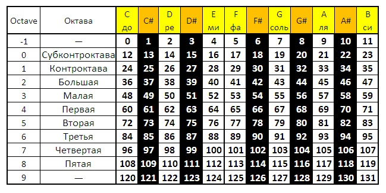

# BigData_project
 
Ссылка на датасет - https://www.kaggle.com/sabermalek/iranian-traditional-music

## Перевод в ноты и из нот

Формат `Midi` нам позволяет узнать, какая клавиша (нота) была зажата или отпущена. Каждому номеру соответствует определенная нота в определенной октаве. Так же в каждом сообщении передается время, которое прошло с предыдущего сообщения. Таким образом можно вычленить саму ноту и ее длительность.
Строчная буква обозначает обычную ноту (adcdefg), прописная буква - ноту с диезом (ABCDEFG). Из номера ноты получаем ноту и её октаву.

Обычно такт мелодии это 3/4 или 4/4. Длительность получаем из того времени, которое нота звучала. То есть разница между нажатием и отпусканием. Но полученная разница выражена в тиках. Тики - это число, которое отражает счет мелодии. Так вот тики - это число ударов в 1/4. Поэтому, чтобы получить длительность, нужно разделить время на количество тиков, умноженное на 4.

Еще считаются паузы; обозначаются р0х, где х - длительность паузы

#### Пример:



```
note_on channel=8 note=58 velocity=96 time=2
note_off channel=8 note=58 velocity=0 time=183
```

Включилась нота 58 - это ля диез 3 октавы. Значит код этой ноты будет А4. (0:это -1 октава, 1: субконтроктава и т.д.).

Теперь с длительностями. time = 2 в первой строчке означает, что с последней команды прошло всего 2 тика. Обычно тиков - 192. Значит пауза длилась 2/(192*4). Это даже меньше 1/16 - а это самая короткая длительность в мелодии. Поэтому даже не учитываем эту паузу. Следующая строчка - так же нота. Выключение произошло через 183 тика после включения. Это 183/(192*4) = примерно 1/4
 
А ну, и полный код этой ноты получился А42 - ля диез 3 октавы с длительностью 1/4.
Я в коде в комменте писала, какая длительность какой цифре соответствует: 0 - 1/16, 1 - 1/8, 2 - 1/4 и т.д.
```
0 - 1/16
1 - 1/8
2 - 1/4
3 - 3/8
4 - 1/2
5 - 3/4
6 - 1
```
