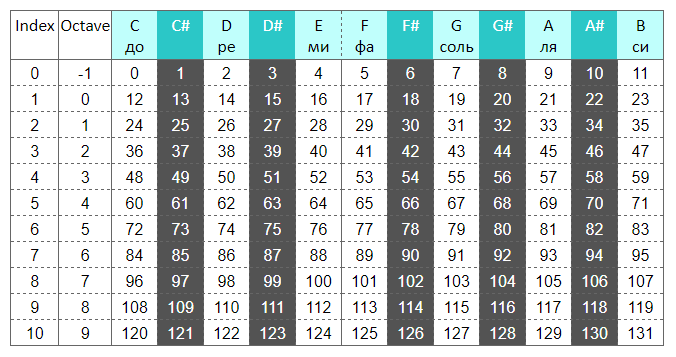

# BigData_project

[Ссылка на презентацию](https://www.shorturl.at/krxU4)  
[Ссылка на датасет](https://www.kaggle.com/function9/blues-genre-midi-melodies)

### Постановка задачи

Продолжить мелодию по нескольким нотам, с учетом различных октав и длительностей.

Для выполнения данной задачи, мы сначала выделили основные этапы:
* поиск подходящего датасета;
* перевод нот в удобный для работы с нейросетью алфавит;
* составление словарей с нотами;
* поиск оптимальной архитектуры сети.


### Поиск датасета
Так как мы нашли датасет который состоит только из мелодий, нам не пришлось решать задачу отделения мелодии от аккомпанимента. С одной стороны это облегчило нам задачу, с другой наша система работает только с форматами `mid` и `midi`. [`MIDI`](https://ru.wikipedia.org/wiki/MIDI) - это стандарт цифровой звукозаписи на формат обмена данными между электронными музыкальными инструментами. [Ссылка на датасет.](https://www.kaggle.com/function9/blues-genre-midi-melodies)


### Перевод в ноты и из нот

Формат `MIDI` позволяет узнать, какая клавиша (нота) была зажата или отпущена. Каждому номеру соответствует определенная нота в определенной октаве. Так же в каждом сообщении передается время, которое прошло с предыдущего сообщения. Таким образом определяется нота и ее длительность. Обычно файлы `midi` состоят из команд, где каждая команда означает зажатие или отпускание клавиши.  

Содержание команды: 
* `note_on`  - клавиша зажата
* `note_off` - клавиша отпущена
* `note` - номер клавиши
* `time` - количество тиков с момента предыдущей команды

В системе используется стандартное обозначение нот в строчном варианте (`adcdefg`) для обычных нот, а ноты с диезом обозначались прописными буквами (`ACDFG`). Соответственно из номера клавиши можно получить ноту и её октаву. Однако, данных о том, какая нота играет недостаточно, для воспроизведения мелодии также необходима ее длительность. В `MIDI` длительность выражается в тиках. Тики - это число, которое отражает такт мелодии. Обычно такт мелодии это `3/4` или `4/4`, а количество тиков `192`. А тики показывают число ударов в `1/4`. Поэтому, чтобы получить длительность ноты, нужно разделить длительность ноты в тиках на общее количество тиков (`192`) умноженное на `4`. 

Отсюда выводится следующая формула:   
``
Длительность = time/(192*4)
``

Кроме длительностей также считаются паузы между нотами. Они обозначаются как `р0х`, где `х` - длительность паузы.

#### Пример:



```
note_on channel=8 note=58 velocity=96 time=2
note_off channel=8 note=58 velocity=0 time=183
```

Зажата клавиша 58 - это ля диез 3 октавы. Значит код этой ноты будет А4.

Теперь с длительностями: `time = 2` в первой строчке означает, что с последней команды прошло 2 тика. Значит пауза длилась `2/(192*4)`. Это даже меньше `1/16` - а это самая короткая длительность в мелодии, поэтому даже не учитываем эту паузу. Следующая строчка - так же нота. Выключение произошло через `183` тика после включения. Это `183/(192*4) ≈ 1/4`

Каждой длительности соответствует свой индекс:
* `0` - `1/16`
* `1` - `1/8`
* `2` - `1/4`
* `3` - `3/8`
* `4` - `1/2`
* `5` - `3/4`
* `6` - `1`

И подводя итог, полный код этой команды получился А42 - ля диез 3 октавы с длительностью 1/4.

### Составление словаря

Берет `10` нот из данных и приводит к одной ноте со смещением.

### Архитектура нейросети

Было решено использовать сети `LSTM` так как они реагируют с учетом своих вопоминаний. 
Были использованы следущие слои:
1. Инициализация линейной модели.
2. `LSTM` на `128` нейронов с передачей на следующий слой. 
3. `LSTM` на `128` нейронов без передачи на следующий слой. 
4.  Полносвязный слой с функцией активации `softmax`.

Для компиляции использовалась функция потерь `categorical_crossentropy` и оптимизатор `adam`. Модель обучалась `300` эпох на `20`мелодиях.

### Предсказание мелодии

Для предсказания используется `10` рандомных нот из обучающей выборки. Используется именно обучающая выборка чтобы избежать ситуации, когда одной из нот, отправленной на предсказание, нет в словаре.

