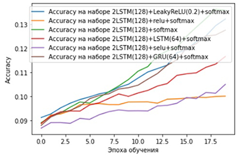
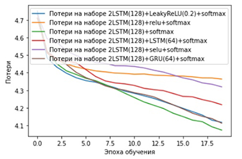

# BigData_project

[Ссылка на презентацию](https://www.shorturl.at/krxU4)  
[Ссылка на датасет](https://www.kaggle.com/function9/blues-genre-midi-melodies)

### Постановка задачи

Продолжить мелодию по нескольким нотам, с учетом различных октав и длительностей.

Для выполнения данной задачи, мы сначала выделили основные этапы:
* поиск подходящего датасета;
* перевод нот в удобный для работы с нейросетью алфавит;
* составление словарей с нотами;
* поиск оптимальной архитектуры сети.


### Поиск датасета
Так как мы нашли датасет который состоит только из мелодий, нам не пришлось решать задачу отделения мелодии от аккомпанемента. С одной стороны это облегчило нам задачу, с другой наша система работает только с форматами `mid` и `midi`. [`MIDI`](https://ru.wikipedia.org/wiki/MIDI) - это стандарт цифровой звукозаписи на формат обмена данными между электронными музыкальными инструментами.  
[Ссылка на датасет.](https://www.kaggle.com/function9/blues-genre-midi-melodies)


### Перевод в ноты и из нот

Формат `MIDI` позволяет узнать, какая клавиша (нота) была зажата или отпущена. Каждому номеру соответствует определенная нота в определенной октаве. Так же в каждом сообщении передается время, которое прошло с предыдущего сообщения. Таким образом определяется нота и ее длительность. Обычно файлы `midi` состоят из команд, где каждая команда означает зажатие или отпускание клавиши.  

Содержание команды: 
* `note_on`  - клавиша зажата
* `note_off` - клавиша отпущена
* `note` - номер клавиши
* `time` - количество тиков с момента предыдущей команды

В системе используется стандартное обозначение нот в строчном варианте (`adcdefg`) для обычных нот, а ноты с диезом обозначались прописными буквами (`ACDFG`). Соответственно из номера клавиши можно получить ноту и её октаву. Однако, данных о том, какая нота играет недостаточно - для воспроизведения мелодии также необходима ее длительность. В `MIDI` длительность выражается в тиках. Тики - это число, которое отражает такт мелодии. Обычно такт мелодии это `3/4` или `4/4`, а количество тиков `192`. А тики показывают число ударов в `1/4`. Поэтому, чтобы получить длительность ноты, нужно разделить длительность ноты в тиках на общее количество тиков (`192`) умноженное на `4`. 

Отсюда выводится следующая формула:   
``
Длительность = time/(192*4)
``

Кроме длительностей также считаются паузы между нотами. Они обозначаются как `р0х`, где `х` - длительность паузы.

#### Пример:


```
note_on channel=8 note=58 velocity=96 time=2
note_off channel=8 note=58 velocity=0 time=183
```

Зажата клавиша 58 - это ля диез 3 октавы. Значит код этой ноты будет А4.

Теперь с длительностями: `time = 2` в первой строчке означает, что с последней команды прошло 2 тика. Значит пауза длилась `2/(192*4)`. Это даже меньше `1/16` - а это самая короткая длительность в мелодии, поэтому даже не учитываем эту паузу. Следующая строчка - та же нота. Выключение произошло через `183` тика после включения. Это `183/(192*4) ≈ 1/4`

Каждой длительности соответствует свой индекс:
* `0` - `1/16`
* `1` - `1/8`
* `2` - `1/4`
* `3` - `3/8`
* `4` - `1/2`
* `5` - `3/4`
* `6` - `1`

И подводя итог, полный код этой команды получился А42 - ля диез 3 октавы с длительностью 1/4.

### Составление словаря

На основе алфавита и входных данных создаем 2 словаря: из ноты в индекс и из индекса в ноту.

### Архитектура нейросети

LSTM сеть - это особый вид рекуррентной нейронной сети, содержащей обратные связи, позволяющей сохранять информацию и способной изучать долгосрочные зависимости в данных. Мелодия - это временной ряд, поэтому нам необходимо регулярно обращаться к ней и учитывать долгосрочный контекст, для этого рекуррентные нейронные сети с LSTM и предназначены. Поэтому было решено использовать сети `LSTM`, так как они реагируют с учетом своих вопоминаний. 

Структура LSTM-сети напоминает цепочку из модулей. Каждый модуль состоит из 4 взаимодействующих слоёв, каждый из которых представляют собой подобие фильтра. На вход LSTM-модуля подаётся последовательность. Часть входных данных, поданная на LSTM-модуль, выходит из него почти в неизменном виде - это долгосрочная память. Второй вход - вход предыдущего модуля. 
Внутри модуля 4 нейрона, 3 из них имеют переходную функцию сигма, он принимает значения от 0 до 1. Оставшийся нейрон имеет переходную функцию гиперболический тангенс, которая принимает значения от -1 до 1. 

На первом шаге входные данные проходят через фильтр с сигмоидальной функцией. Он определяет, какая информация из предыдущего состояния ячейки должна быть забыта. Переданные же данные перемножаются с данными долгосрочной памяти. 
На следующем шаге переходная функция сигма определяет, какие значения следует обновить, эти данные затем проходят через функцию тангенса, который решает, какие данные добавятся к данным по линии долгосрочной памяти. 
Последние элементы решают, какая информация будет передана на выход. Сначала применяется сигмоидальный слой. Смоделированные от -1 до 1 данные, переданные функцией тангенса из долгосрочной памяти, перемножаются с выходными значениями функции сигма. Результат переходит по линии краткосрочной памяти.

Были использованы следущие слои:
1. Инициализация линейной модели.
2. `LSTM` на `256` нейронов с передачей на следующий слой. 
3. `LSTM` на `256` нейронов без передачи на следующий слой. 
4.  Полносвязный слой с функцией активации `softmax`.

Для компиляции использовалась функция потерь `categorical_crossentropy` и оптимизатор `adam`. Модель обучалась `400` эпох на `20`мелодиях.

### Альтернативные варианты

Мы не случайно решили использовать заявленую конфигурацию. После первых полученных результатов, было решено провевести небольшое исследование и найти наиболее подходящее сочетание слоев, для более точного продолжения мелодии. На графиках представлены зависимоти метрик `accuracy` и `loss` от конфигурации слоев.
 
   
Также мы думали попробовать одномерные сверточные сети из-за того, что они хорошо работают с последовательностями. Однако, данный вариант был отложен в сторону, потому что пришел позже, чем `2*LSTM(256)`.

### Предсказание мелодии

Для предсказания используется `10` рандомных нот из обучающей выборки. Каждая следующая нота предсказывается по 10 нотам со смещением на ранее предсказанную ноту. Используется именно обучающая выборка чтобы избежать ситуации, когда одной из нот, отправленной на предсказание, нет в словаре.

### Дальнейшее развитие

На данном этапе система обучается на 20 мелодиях и предсказывает продолжение мелодии на том же наборе данных. Проект требует доработки в подборе подходящей архитектуры для обучения на более широком наборе обучающих данных, создания расширенного словаря. Это необходимо для того, чтобы предсказание могло происходить и на последовательности нот не из обучающего набора.
